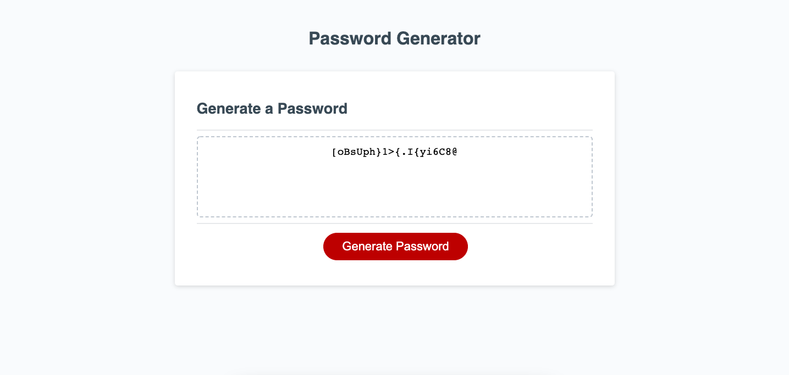

# Password Generator

This is my script for the password generator assignment. In it are functions that ask the user if they want to include uppercase letters, lowercase letters, numbers, and/or special characters. After which, given the criteria established by the user, the script iterates through the length of characters stored in the pW object at random to produce the random password the user wanted based on their criteria.

## Languages Used
* JavaScript
* Css
* HTML

## Photo
